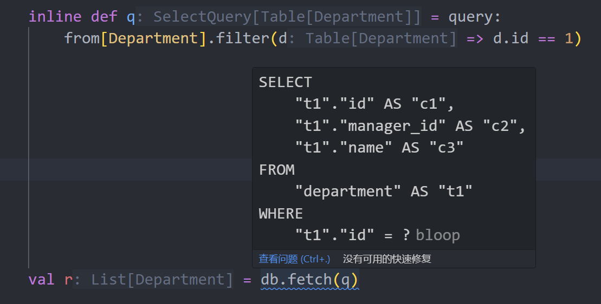

# sqala简介

sqala是一个基于Scala 3的SQL查询库，得名于Scala和SQL的结合。

使用sqala，你可以：

1. 使用面向对象的方式构建查询：

    ```scala
    case class User(id: Int, name: String)

    val q = query:
        from[User]
            .filter(u => u.id == 1)
            .map(u => u.name)

    val i = insert(User(1, "小黑"))
    ```

2. 使用命名元组管理投影，无需为投影结果预先创建接收结构，也无需使用`Map[String, Any]`，并使用`.`调用返回字段：

    ```scala
    val q = query:
        from[User].map(u => (id = u.id))

    val result = db.fetch(q)

    for r <- result do
        println(r.id)
    ```

3. 使用Scala3的`inline`能力生成高性能的反序列化代码，速度是基于反射的Java主流查询库的3-10倍。

4. 在编译期显示生成的SQL语句：

    

5. 在编译期捕捉大多数错误查询，并返回语义化的编译警告：

    

6. 支持MySQL、PostgreSQL、Oracle在内的多种方言，同一个查询表达式传入不同的方言参数即可生成不同的SQL。

7. 支持Oracle的递归查询功能`CONNECT BY`，但会生成各数据库通用的标准SQL：

    ```scala
    case class Department(id: Int, managerId: Int, name: String)

    val q = query:
        from[Department]
            .connectBy(d => prior(d.id) == d.managerId)
            .startWith(d => d.managerId == 0)
            .map(d => (id = d.id, managerId = d.managerId, name = d.name))
    ```

8. 不仅是CRUD，sqala还支持多维分组、子查询谓词、`LATERAL`子查询等高级功能，为数据分析场景也提供了有力支撑。

9. `dynamic`模块提供了可以动态构造复杂查询的DSL和SQL解析器，为动态构建报表等应用提供支持。

10. 除Scala、Java官方库外，没有额外依赖。

## 注意事项

1. 由于sqala目前没有基于Scala3 LTS版本构建，在Scala3发布下一个LTS版本之前，应用在生产环境需谨慎。

2. 请确保Scala版本在`3.7.0`及以上。

3. 尽量使用Scala官方的metals插件配合VSCode、Vim等工具使用，IDEA系列目前无法获得编写提示，也无法正确显示查询返回的数据类型。
